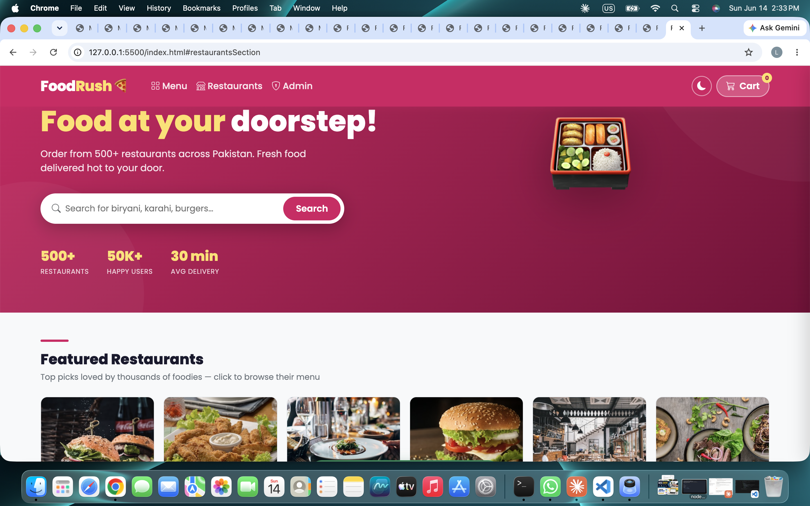
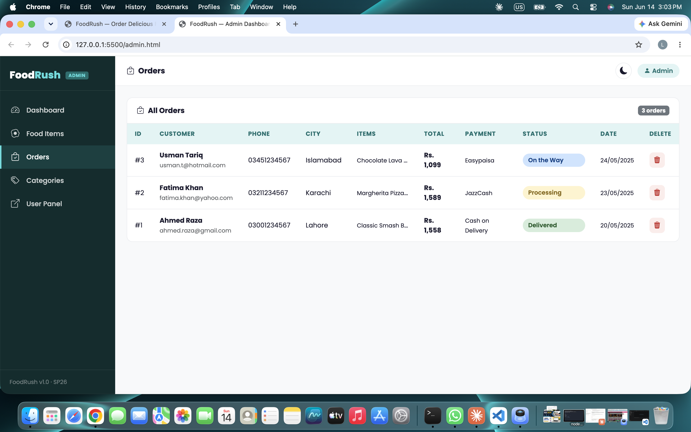
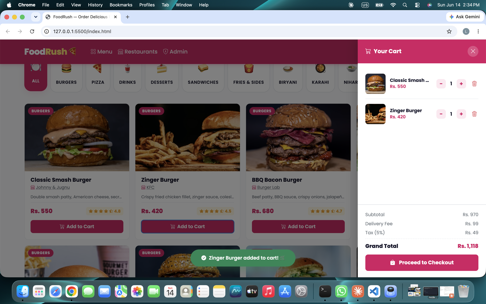
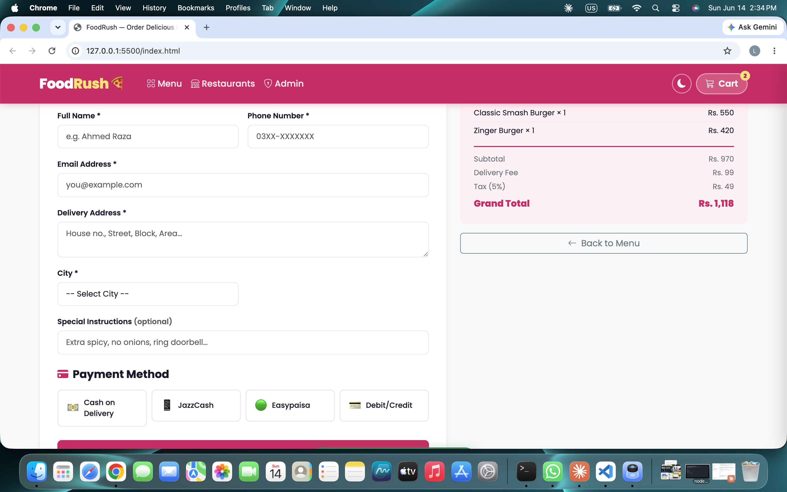

# FoodRush 🍕

**Student Name:** [Laraib Fatima] 
**Roll Number:** [F24BDOCS1M04005] 
**Course:** Web Technologies — SP26. BSCS 4TH Semester
**Section:** [1M]

---

## Project Overview

FoodRush is a Foodpanda-inspired food ordering web application built for the Web Technologies SP26 Capstone Project. It features a user-facing ordering panel and a separate admin dashboard, powered by a JSON Server mock REST API.

**Domain:** Food Ordering (E-Commerce)  
**Theme:** Pink Foodpanda-style (User Panel) | Teal/Navy (Admin Panel)

---

## Technology Stack

| Layer | Technology |
|-------|-----------|
| Markup | HTML5 (semantic) |
| Styling | Bootstrap 5 + Custom CSS |
| JavaScript | Vanilla JS (ES6+, async/await) |
| Backend | JSON Server (mock REST API) |
| Data | db.json |

---

## Project Structure

```
FoodRush/
├── index.html      → User Panel (browse menu, cart, checkout)
├── admin.html      → Admin Dashboard (CRUD, stats, orders)
├── style.css       → Shared + User styles
├── app.js          → User Panel JavaScript
├── admin.js        → Admin Panel JavaScript
├── db.json         → JSON Server database
└── README.md       → This file
```

---

## Setup & Run Instructions

### Prerequisites
- Node.js installed (https://nodejs.org)
- JSON Server installed globally

### Step 1 — Install JSON Server
```bash
npm install -g json-server
```

### Step 2 — Start JSON Server
Navigate to the project folder and run:
```bash
npx json-server --watch db.json --port 3000
```

You should see:
```
Resources
  http://localhost:3000/foods
  http://localhost:3000/orders
  http://localhost:3000/categories
```

### Step 3 — Open the App
Open `index.html` in your browser (Chrome recommended).  
Open `admin.html` for the Admin Dashboard.

> **Note:** Both pages require JSON Server to be running at `http://localhost:3000`.

---

## Features

### User Panel (`index.html`)
- ✅ Browse food menu fetched from JSON Server (GET)
- ✅ Filter by food category (chips)
- ✅ Search food by name, category, or restaurant (debounced)
- ✅ Loading skeleton while data fetches
- ✅ Error state if JSON Server is unreachable
- ✅ Slide-out cart sidebar with add/remove/quantity controls
- ✅ Dynamic cart totals (subtotal, delivery Rs. 99, 5% tax, grand total)
- ✅ Full checkout form with 6 validated fields (inline validation, no alerts)
- ✅ 4 payment methods: Cash on Delivery, JazzCash, Easypaisa, Debit/Credit Card
- ✅ Order submission via POST to JSON Server
- ✅ UI re-renders automatically after successful order
- ✅ Dark Mode toggle (persisted via localStorage)
- ✅ Fully mobile responsive

### Admin Panel (`admin.html`)
- ✅ Dashboard with 4 statistics: Total Foods, Total Orders, Total Revenue, Most Ordered Item
- ✅ Food Items table with search filter
- ✅ Add new food item (POST)
- ✅ Edit food item with inline form (PATCH)
- ✅ Delete food item with confirmation modal (DELETE)
- ✅ View all orders table
- ✅ Delete orders
- ✅ Manage categories (Add, Edit, Delete)
- ✅ Visually distinct teal/navy theme with sidebar layout
- ✅ Dark mode toggle

### Bonus Features Implemented
- ✅ Bootstrap 5 used consistently throughout both panels
- ✅ Debounced search bar (350ms delay)
- ✅ Dark mode toggle persisted in localStorage
- ✅ Mobile-responsive layout

---

## HTTP Methods Used

| Method | Endpoint | Purpose |
|--------|----------|---------|
| GET | /foods | Fetch all food items |
| GET | /orders | Fetch all orders |
| GET | /categories | Fetch all categories |
| POST | /orders | Place a new order |
| POST | /foods | Add new food (admin) |
| POST | /categories | Add new category (admin) |
| PATCH | /foods/:id | Edit existing food (admin) |
| PATCH | /categories/:id | Edit category (admin) |
| DELETE | /foods/:id | Delete food item (admin) |
| DELETE | /orders/:id | Delete order (admin) |
| DELETE | /categories/:id | Delete category (admin) |

---

## Database Schema (`db.json`)

### foods
```json
{
  "id": 1,
  "name": "Chicken Biryani",
  "category": "Biryani",
  "restaurant": "Café Zouk",
  "price": 450,
  "rating": 4.8,
  "image": "https://...",
  "available": true
}
```

### orders
```json
{
  "id": 1,
  "customerName": "Ahmed Raza",
  "phone": "03001234567",
  "email": "ahmed@gmail.com",
  "address": "House 12, Street 5",
  "city": "Lahore",
  "paymentMethod": "Cash on Delivery",
  "items": [{ "foodId": 1, "name": "Chicken Biryani", "price": 450, "quantity": 2 }],
  "totalAmount": 1320,
  "status": "Processing",
  "orderDate": "2025-05-20T14:30:00Z"
}
```

### categories
```json
{ "id": 1, "name": "Biryani" }
```

### Project Screenshots

**User Panel:**


**Admin Panel:**


**Cart Page:**


**Checkout Page:**



---

## Submission Checklist
- ✅ index.html — User Panel
- ✅ admin.html — Admin Panel
- ✅ style.css — All styles
- ✅ app.js — User JS
- ✅ admin.js — Admin JS
- ✅ db.json — JSON Server database
- ✅ README.md — This file
- ✅ No node_modules in zip
- ✅ No hardcoded arrays in JS
- ✅ All 4 HTTP methods used
- ✅ Bootstrap 5 throughout